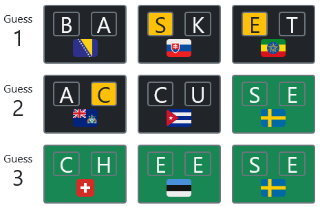

# Flagwords!

A Wordle clone where every word is a combination of ISO 3166-1 Alpha-2 (in other words, every word can be written using flag emojis).

### Features:

- Unlimited guesses
- 1 word a day
- Hints (in blue) if you’re stuck

### Future features:

- Score sharing
- Classic Wordle-type keyboard

### Credits:

- A bit of code by [Raph V.](https://github.com/raphv/)
- Styles from [Bootstrap](https://getbootstrap.com/)
- Flags from [Twemoji](https://twemoji.twitter.com/)
- Icons from [FontAwesome](https://fontawesome.com/)

Please provide feedback (improvements, features, words, bugs, etc.) here!
